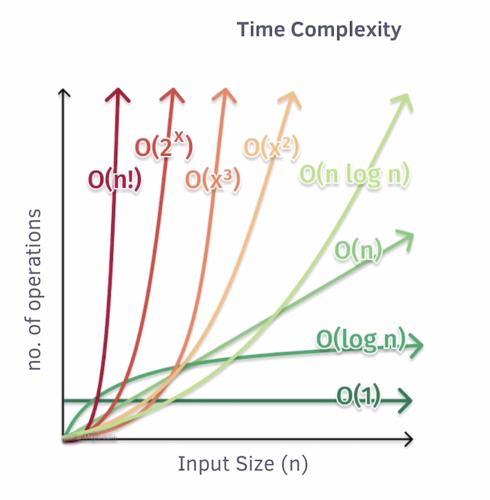
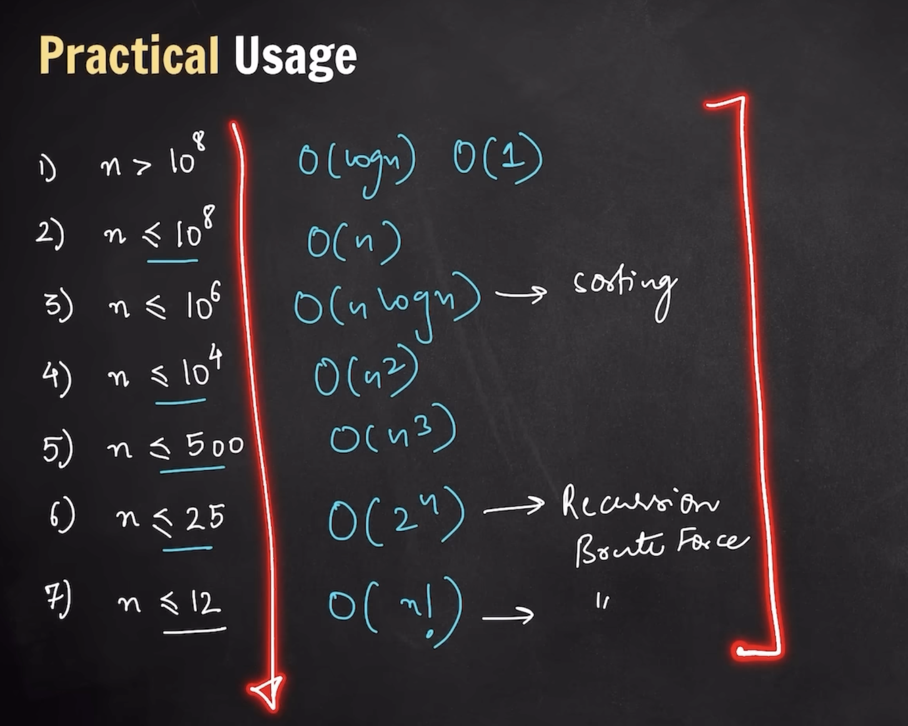

## Time Complexity

- NOT the actual time taken
- but the **amount of time taken or operations** as **<u>function of input size</u>** - `f(n)`
- gives the behaviour of time taken as a funtion of input size

### Big O Notation - `O(n)`

- Give worst case complexity or scenario or upper bound
- Steps to find out

  1. Ignore constants
  2. Ignore lower degree variables

  ```math
  \begin{array}{l}
  f(n) = 5n^2 + 100n + 5\\\\

  Step\ 1: Ignore\ constants\\
  f(n) = n^2 + n + 1\\\\

  Step\ 2: Ignore\ lower\ degree\ variables\\
  f(n) = n^2\\\\

  O(n^2)
  \end{array}
  ```

Different Time Complexity notations

1. `O` - (worst case) - upper bound
2. `θ` - (average case)
3. `Ω` - (best case) - lower bound

_For more info on other notation and derivation, read about_

- _Cormen's Book_
- _Master Theorem_

## Space Complexity

- NOT the actual space taken by the algorithm.
- Amount of space taken by an algorithm of input size n - `f(n)`
- 2 type of space

  1. Input - `Not considered`
  2. Auxilary - `Considered`

Examples:

- Program to find the squares of element in an array - `O(n)`
- Program to find the sum of all the element in an array - `O(1)`

#### Different Time Complexity Graph



## Common Time Complexity examples

1. `O(1)` - Constant

   1. Sum of `n` natural numbers

   ```c++
   int n;
   cin >> n;
   int sum = n * (n+1)/2;
   ```

   2. Hashmap's opertation - `Amortized constant time complexity`

   - We assume it as constant, but pratically it's not
   - here amortized means, on average, it gives constant time complexity
   - gradually write off the initial cost of over a period

2. `O(n)` - Linear

   1. N Factorial

   ```c++
   int fact=1;
   for (int i=1; i<=num; i++){
       fact *= i;
   }
   ```

   2. Nth Fibbonacci Series

   ```c++
   #include <bits/stdc++.h>
   using namespace std;


    // Function to calculate the nth Fibonacci number using recursion
    int nthFibonacci(int n){
    // Handle the edge cases
    if (n <= 1)
    return n;

        // Create a vector to store Fibonacci numbers
        vector<int> dp(n + 1);

        // Initialize the first two Fibonacci numbers
        dp[0] = 0;
        dp[1] = 1;

        // Fill the vector iteratively
        for (int i = 2; i <= n; ++i){

            // Calculate the next Fibonacci number
            dp[i] = dp[i - 1] + dp[i - 2];
        }

        // Return the nth Fibonacci number
        return dp[n];

    }

    int main(){
    int n = 5;
    int result = nthFibonacci(n);

    cout << result << endl;

    return 0;

    }
   ```

   3. Kadane's Algorithm - Max SubArray Sum

   ```c++
   int currSum=0, ans = INT_MIN;
   for (int i=0; i<n; i++){
       currSum += arr[i];
       ans = max(currSum, ans);
       currSum = currSum < 0 ? 0 : currSum;
   }
   ```

3. `O(n^2)`

   1. Bubble Sort, Insertion Sort, pattern questions

   ```c++
   for(int i=0; i<n-1; i++){
       for(int j=0; j<n-i-1; j++){
           if(arr[i] > arr[j+1])
               swap(arr[i], arr[j+1]);
       }
   }
   ```

4. `O(n^3)`

   1. Print all possible subArray of an array

5. `O(log(n))`

   1. Binary Search - Applied on a sorted array

   ```c++
   int st = 0, en = n - 1;
   while(st <= en){
       int mid = st + (en - st)/2;
       if (arr[mid] < target){
           st = mid + 1;
       }
       else if (arr[mid] > target){
           en = mid - 1;
       }
       else{
           return mid; // ans
       }
   }

   ```

6. `O(nlog(n))`

   1. Optimized sorting algo - MergeSort, QuickSort (average case)
   2. Greedy Algorithm

7. `O(2^n)` or `O(3^n)` --> `O(a^n)` --> `Exponential Compplexity`

   1. Brute Force Recusion - w/o any optimization

8. `O(n!)` - `not so common`

   1. nQueens - Brute force method
   2. KnightsTour - Brute force method
   3. String - All possible permutions

## Hint to apply the type of algorithm from the constraints

- 10^8 opertations/ sec on coding platform typically


